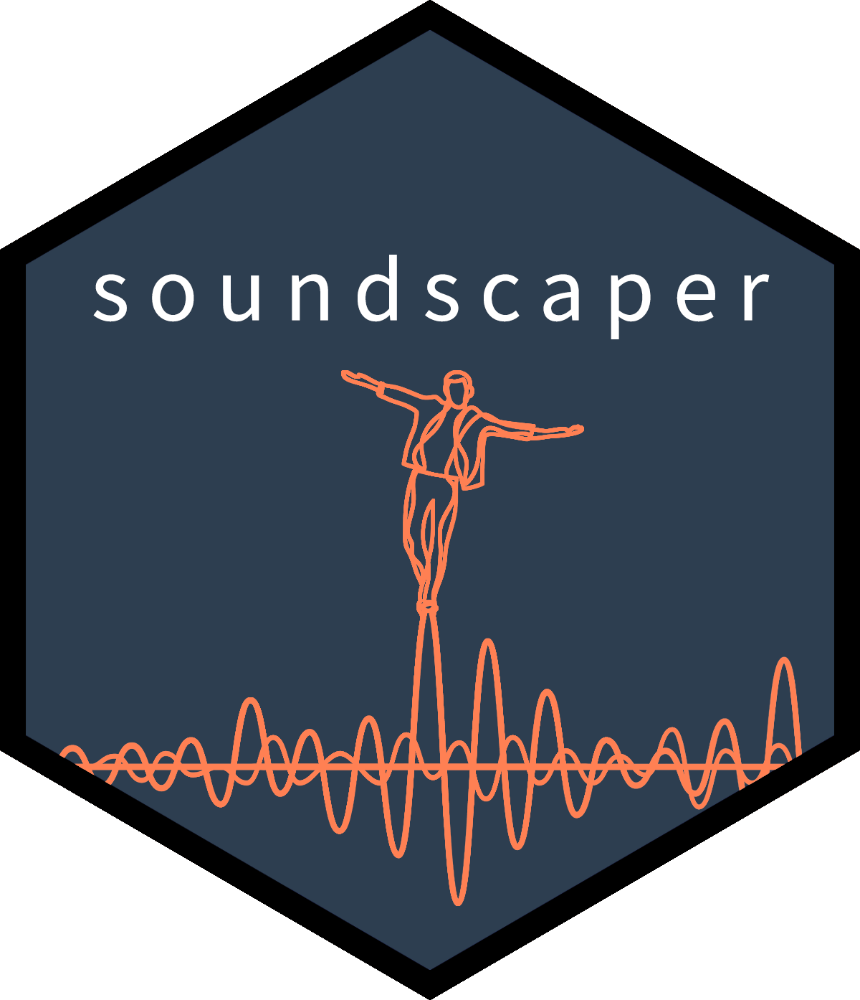
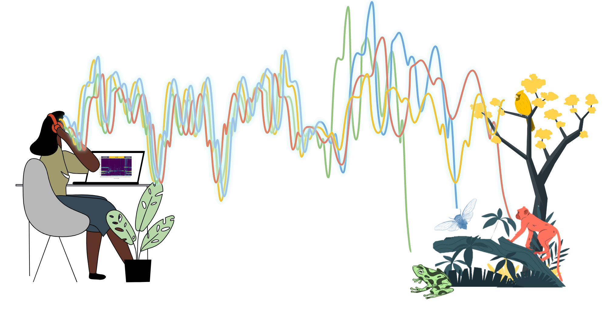
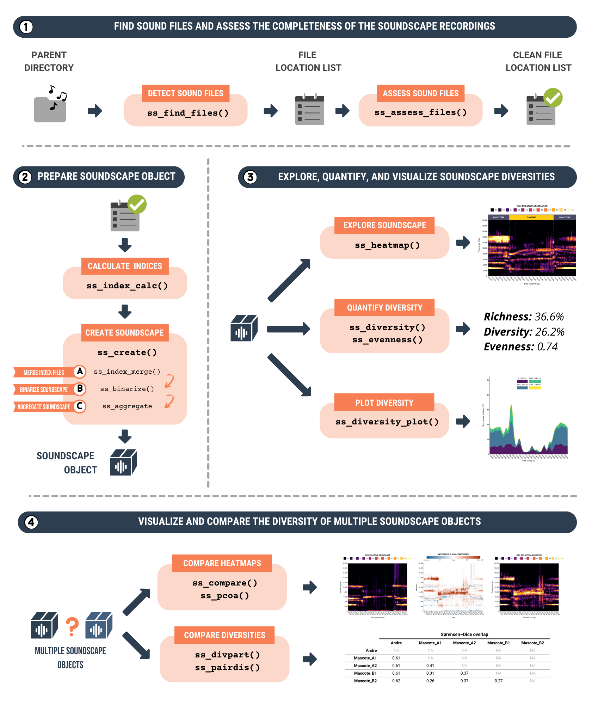

<!-- README.md is generated from README.Rmd. Please edit that file -->

```{r, include = FALSE}
knitr::opts_chunk$set(
  collapse = TRUE,
  comment = "#>",
  fig.path = "man/figures/README-",
  out.width = "100%"
)
```


# soundscapeR 

<!-- badges: start -->
[](https://github.com/ThomasLuypaert/soundscapeR/actions/workflows/R-CMD-check.yaml)
[](https://codecov.io/gh/ThomasLuypaert/soundscapeR)
<a href="https://www.repostatus.org/#wip"></a>
<!-- badges: end -->

[Thomas Luypaert](https://thomasluypaert.weebly.com/), Anderson S. Bueno, Tom Bradfer-Lawrence, Carlos A. Peres, Torbjørn Haugaasen


### A package for soundscape diversity quantification using Hill numbers 

Welcome to the `soundscapeR` R-package! \
\
The goal of `soundscapeR` is to provide a standardized analytical pipeline for the computation, exploration, visualization, diversity quantification and comparison of soundscapes using Hill numbers. The package is designed to work with either continuous or regular-interval long-duration acoustic recordings, and can quantify the diversity of soundscapes using a range of different diversity types (richness, evenness & diversity), spatial scales (alpha, beta and gamma diversities), and spectro-temporal subsets.

If you are unfamiliar with the `soundscapeR` workflow, head on over to [Luypaert et al. (2022)](https://besjournals.onlinelibrary.wiley.com/doi/full/10.1111/2041-210X.13924) and take a look at the theoretical concepts. For an example of how the functions of the `soundscapeR` package can be used to elucidate ecological patterns, have a look at [Luypaert et al. (2023)](https://www.biorxiv.org/content/10.1101/2023.02.08.527658v1). 

 


### Installation

For the moment, the `soundscapeR` package is still under development, and can therefore only be downloaded from GitHub. To download the development version of our package, please use the code provided below. 

```{r eval = FALSE}
## Install from github

##install.packages("remotes") ## if needed

remotes::install_github("ThomasLuypaert/soundscapeR", build_vignettes = TRUE)

```

### Workflow overview

A comprehensive introduction to `soundscapeR` and specific examples of package usage can be found at [thomasluypaert.github.io/soundscapeR_vignette](https://thomasluypaert.github.io/soundscapeR_vignette/). For a sneak peak at the workflow and the associated functions, have a look at this figure: 

 

### Acknowledgements

Acknowledgements here...

### Contribution

Instructions on contributions here...

### Citation

Example of citation here...


