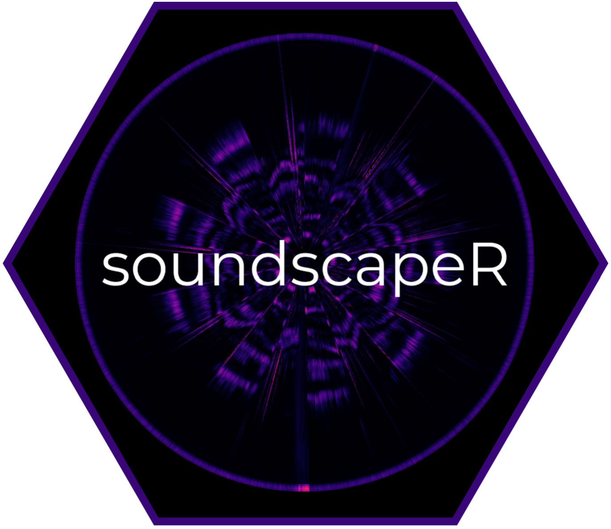

soundscapeR: soundscape diversity quantification
================
Thomas Luypaert, Anderson S. Bueno, Tom Bradfer-Lawrence, Carlos A.
Peres, Torbjørn Haugaasen

<!-- README.md is generated from README.Rmd. Please edit that file -->
<!-- badges: start -->

<!-- badges: end -->

|                                                                     |                                                                                                                                                                                                                                                                                                                                                                                                                                                                |
|---------------------------------------------------------------------|----------------------------------------------------------------------------------------------------------------------------------------------------------------------------------------------------------------------------------------------------------------------------------------------------------------------------------------------------------------------------------------------------------------------------------------------------------------|
|  | The goal of `soundscapeR` is to provide a standardized analytical pipeline for the computation, exploration, visualization, comparison, and diversity quantification of soundscapes. The package is designed to work with either continuous or regular-interval long-duration acoustic recordings. More information about the workflow can be found in [Luypaert et al. (2022)](https://besjournals.onlinelibrary.wiley.com/doi/full/10.1111/2041-210X.13924). |

  
  

To access the full `soundscapeR` vignette, head on over to
[thomasluypaert.github.io/soundscapeR_vignette](https://thomasluypaert.github.io/soundscapeR_vignette/).
