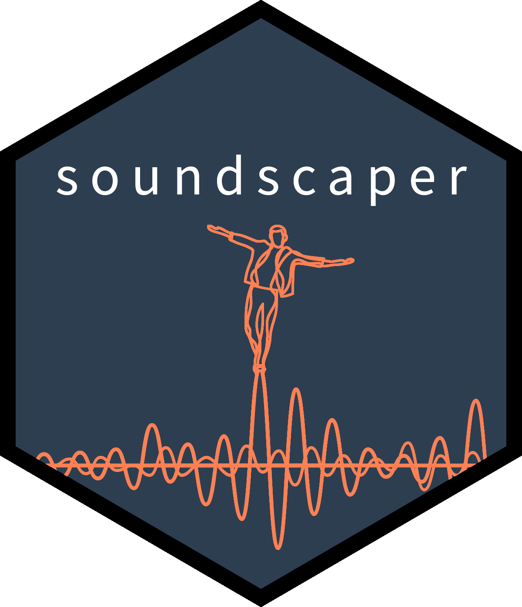

soundscapeR: soundscape diversity quantification
================
Thomas Luypaert, Anderson Saldanha Bueno, Carlos Augusto Peres, Torbjørn
Haugaasen

<!-- README.md is generated from README.Rmd. Please edit that file -->
<!-- badges: start -->

[](https://github.com/ThomasLuypaert/soundscapeR/actions/workflows/R-CMD-check.yaml)
<!-- badges: end -->

|                                                                   |                                                                                                                                                                                                                                                                                                                                                                                                                         |
|-------------------------------------------------------------------|-------------------------------------------------------------------------------------------------------------------------------------------------------------------------------------------------------------------------------------------------------------------------------------------------------------------------------------------------------------------------------------------------------------------------|
|  | The goal of `soundscapeR` is to provide a standardized analytical pipeline for the computation, exploration, visualization and diversity quantification of soundscapes. The package is designed to work with either continuous or regular-interval long-duration acoustic recordings, and can handle both audible and ultrasonic recordings. More information about the workflow can be found in Luypaert et al. (2022) |

# 0. Priors

This R-package uses spectral index output files computed using the
[‘AnalysisPrograms’](https://ap.qut.ecoacoustics.info/) software tool,
developed by the [QUT Ecoacoustics
Group](https://research.ecosounds.org/). Although all the steps in the
analytical pipeline can be performed using `soundscapeR`, the package
requires ‘AnalysisPrograms’ in the background.

As such, prior to using `soundscapeR`, please head over to the
[‘AnalysisPrograms’ download
page](https://ap.qut.ecoacoustics.info/basics/installing.html?tabs=windows),
and install the latest version of the software tool on your device.

# 1. Calculating acoustic indices

For the first step in our workflow, we are going to calculate the
spectral index files for our long-duration acoustic recordings collected
at our site of interest. To do this, we will make use of the
`index_calc()` function.

For the purposes of this vignette, a few raw sound files are provided in
the package data.

``` r
system.file("extdata")
#> [1] ""
```
