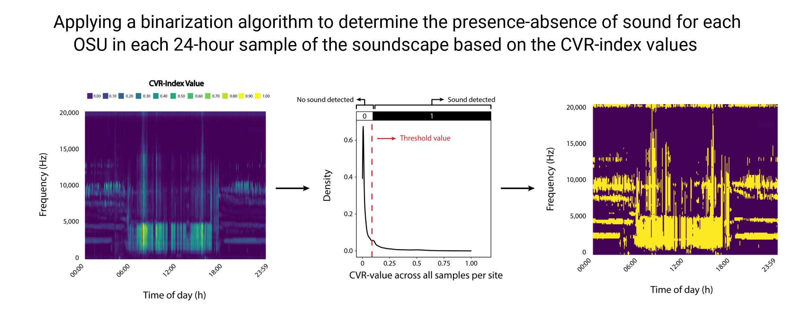

soundscapeR: soundscape diversity quantification
================
Thomas Luypaert, Anderson S. Bueno, Carlos A. Peres, Torbjørn Haugaasen

<!-- README.md is generated from README.Rmd. Please edit that file -->
<!-- badges: start -->

[](https://github.com/ThomasLuypaert/soundscapeR/actions/workflows/R-CMD-check.yaml)
[](https://codecov.io/gh/ThomasLuypaert/soundscapeR)
<!-- badges: end -->

|                                                                   |                                                                                                                                                                                                                                                                                                                                                                                                                         |
|-------------------------------------------------------------------|-------------------------------------------------------------------------------------------------------------------------------------------------------------------------------------------------------------------------------------------------------------------------------------------------------------------------------------------------------------------------------------------------------------------------|
|  | The goal of `soundscapeR` is to provide a standardized analytical pipeline for the computation, exploration, visualization and diversity quantification of soundscapes. The package is designed to work with either continuous or regular-interval long-duration acoustic recordings, and can handle both audible and ultrasonic recordings. More information about the workflow can be found in Luypaert et al. (2022) |

- [Priors](#priors)
  - [Acknowledgements](#acknowledgements)
- [Background](#background)
  - [Theoretical background](#theoretical-background)
  - [Workflow background](#workflow-background)
- [The workflow](#the-workflow)
  - [Collection of acoustic data](#collection-of-acoustic-data)
  - [Measuring acoustic properties per 24h soundscape
    sample](#measuring-acoustic-properties-per-24h-soundscape-sample)
    - [A. Calculating spectral acoustic
      indices](#a.-calculating-spectral-acoustic-indices)
    - [B. Merging the spectral index values
      chronologically](#b.-merging-the-spectral-index-values-chronologically)
  - [The concept of Operational Sound Units
    (OSUs)](#the-concept-of-operational-sound-units-(osus))
  - [Binarization of the CVR-index
    values](#binarization-of-the-cvr-index-values)

# 0. Priors

## 0.1. Acknowledgements

This R-package uses spectral index output files computed using the
‘AnalysisPrograms’ software tool, developed by the [QUT Ecoacoustics
Group](https://research.ecosounds.org/). Although all the steps in the
analytical pipeline can be performed using `soundscapeR`, the package
requires ‘AnalysisPrograms’ in the background.

As such, prior to using `soundscapeR`, feel free to head over to the
[‘AnalysisPrograms’ website](https://ap.qut.ecoacoustics.info/), and
check out their great work!

**!) In the latest version of `soundscapeR`, ‘AnalysisPrograms’ is
automatically installed when calculating acoustic indices for the first
time**

# 1. Background

## 1.1. Theoretical background

Passive Acoustic Monitoring offers numerous opportunities for ecological
monitoring. Technological advancements in recent decades have led to a
great reduction in both the size and cost of automated acoustic sensors,
vastly increasing the spatial scale and temporal scales at which we can
deploy these monitoring devices. Moreover, compared to equivalent active
acoustic sampling by an *in-situ* observer, these recorders can collect
ecological information on a broad range of sound-producing organisms at
reduced effort. Using this acoustic data, the taxonomic diversity of the
sound-producing community can be derived by isolating and identifying
species’ calls, thus providing an objective and permanent record of the
biological community at a given moment in time and space.

$$\\[0.1in]$$

<div class="figure" style="text-align: centre">


<p class="caption">
The benefits of Passive Acoustic Monitoring over conventional active
acoustic sampling by an in-situ observer.
</p>

</div>

$$\\[0.001in]$$ ***Fig 1:*** *The benefits of Passive Acoustic
Monitoring over conventional active acoustic sampling by an in-situ
observer.*

$$\\[0.1in]$$

Yet, obtaining species-level information at large spatio-temporal scales
and taxonomic breath presents numerous difficulties, such as the
time-consuming and knowledge-demanding nature of aural annotation of
sound files, and the paucity of reliable automated species identifiers
and reference databases for most taxa and regions.

$$\\[0.1in]$$

<div class="figure" style="text-align: centre">


<p class="caption">
The factors limiting the extraction of taxonomic information from
acoustic data at broad spatial and temporal scales. The field of
soundscape ecology attempts to derive ecological information from this
big acoustic data while overcoming some of these limitations.
</p>

</div>

$$\\[0.001in]$$ ***Fig 2:*** *The factors limiting the extraction of
taxonomic information from acoustic data at broad spatial and temporal
scales. The field of soundscape ecology attempts to derive ecological
information from this big acoustic data while overcoming some of these
limitations.*

$$\\[0.1in]$$

In addition to taxonomic information, species’ sounds also carry
functional significance. Acoustic signals are crucial for a broad range
of social interactions including courting behaviour, territorial
defence, predator avoidance, and food sharing. Efficient communication
between individuals of the same species has important implications for
fitness. As such, species’ sounds are subject to selective pressures at
multiple scales, resulting in a wide variety of of acoustic traits that
are expressed in the timing, frequency and amplitude features of
acoustic signals.

Several hypotheses aim to explain the processes governing the variation
in the acoustic traits in a biological community:  
  

1.  **The Acoustic Niche Hypothesis** (also known as the theory of
    acoustic niche partitioning):  
    The Acoustic Niche Hypothesis views the time-frequency space
    (hereafter referred to as *acoustic space*) in which species can
    produce vocalizations as a core ecological resource for which
    sound-producing sympatric species compete. This leads to the
    partitioning of the acoustic niche in the time-frequency domain to
    avoid spectro-temporal overlap in vocalizations between individuals
    of different species.  
      

2.  **The Acoustic Adaptation Hypothesis**:  
    The Acoustic Adaptation Hypothesis states that the physical
    properties of the surrounding habitat influence the efficacy of
    sound propagation through absorption, reverberation and scattering,
    and thus, place a selective pressure on acoustic signals to optimize
    propagation distance. In areas with dense vegetation, vocalizations
    degrade much more rapidly than in open areas. However, because of
    frequency-dependent attenuation, low-frequency vocalizations retain
    their acoustic properties much better in these dense habitats than
    high-frequency vocalizations. Additionally, also the temporal
    patterning of vocalizations affects sound attenuation. For instance,
    short notes repeated at longer intervals are less affected by
    reverberations. As such, under the Acoustic Adaptation Hypothesis,
    we expect a greater proportion of low-frequency sounds with slower
    rates of syllable repetition in densely vegetated ecosystems, and
    conversely, more high-frequency sounds with more repetition in open
    habitats.  
      

3.  **The Morphological Constraint Hypothesis**:  
    The Morphological Constraint Hypothesis posits that acoustic traits
    are constrained by morphological parameters such as body size and
    the diversity of acoustic traits has emerged as a by-product of
    selection for optimal morphology. For instance, body mass has a
    strong negative relationship with sound frequency in many species.
    This relationship comes about because body mass is correlated with
    the size of the sound-producing organ (syrinx/larynx/…), and larger
    organs tend to have lower sound-production frequencies.  
      

4.  **The Phylogenetic Constraint Hypothesis**:  
    In analogy with the Morphological Constraint Hypothesis, the
    Phylogenetic Constraint Hypothesis states that it is the
    evolutionary ancestry of a species that limits the range of sound
    frequencies an animal can produce. For example, when deviations from
    the negative allometric relationship between body size and
    vocalization frequency occur, this could be the result of an
    evolutionary history that caused variation in the morphology of the
    sound-producing organ.  
      

5.  **The Sexual Selection Hypothesis**:  
    The Sexual Selection Hypothesis suggests that, if sound frequency is
    an indicator of an individual’s size see the Morphological
    Constraint Hypothesis), dominance, or fighting ability, the
    frequency of acoustic signals might be the result of sexual
    selection.  
      

$$\\[0.1in]$$

<div class="figure" style="text-align: centre">


<p class="caption">
A theoretical visualization of the various ways in which species can
partition their acoustic niche. A. Spatial Niche Partitioning implies
the production of vocalizations in different parts of 3D-space to avoid
overlap acoustic signals. This has been demonstrated for
[cicadas](https://onlinelibrary.wiley.com/doi/10.1046/j.1095-8312.2002.00030.x);
B. Spectral Niche Partitioning implies the shifting of the dominant
frequency peak between individuals of different species to avoid signal
overlap. This has been demonstrated for
[frogs](https://pubmed.ncbi.nlm.nih.gov/25101228/); C. Temporal Niche
Partitioning implies a shift in the time of peak vocal activity between
individuals of different species to minimize signal overlap. This has
been demonstrated between [bird and cicada
species](https://academic.oup.com/beheco/article/26/3/839/234674?login=false).
Note that, in this image, seasonal partitioning of the acoustic niche
was omitted.
</p>

</div>

$$\\[0.001in]$$ ***Fig 3:*** *A theoretical visualization of the various
ways in which species can partition their acoustic niche. A. Spatial
Niche Partitioning implies the production of vocalizations in different
parts of 3D-space to avoid overlap acoustic signals. This has been
demonstrated for
[cicadas](https://onlinelibrary.wiley.com/doi/10.1046/j.1095-8312.2002.00030.x);
B. Spectral Niche Partitioning implies the shifting of the dominant
frequency peak between individuals of different species to avoid signal
overlap. This has been demonstrated for
[frogs](https://pubmed.ncbi.nlm.nih.gov/25101228/); C. Temporal Niche
Partitioning implies a shift in the time of peak vocal activity between
individuals of different species to minimize signal overlap. This has
been demonstrated between [bird and cicada
species](https://academic.oup.com/beheco/article/26/3/839/234674?login=false).
Note that, in this image, seasonal partitioning of the acoustic niche
was omitted.*

$$\\[0.1in]$$

These diverse selective pressures vary across space, thus driving
variation in acoustic trait diversity in the landscape. The field of
soundscape ecology makes use of this acoustic trait variation, using the
soundscape, or the combination of all sounds produced in the landscape,
to make inference about ecological processes at a landscape-scale. The
value of soundscape research lies in its ability to detect ecological
signals from big acoustic data collected at broad spatial and temporal
scales with minimized cost and effort, and crucially, without the need
for species identification. To achieve this, researchers make use of
acoustic indices, or mathematical formulae which extract information on
the diversity of acoustic traits across the time-frequency domain of
sound files. To date, over 60 acoustic indices have been developed, each
of which reflects some aspect of the diversity of acoustic traits in a
sound file. These acoustic indices have been successfully used as
descriptors of landscape configuration and ecosystem health, diel
patterns in different environments, seasonal changes in soundscapes, and
habitat identity, among others. Finally, acoustic indices have also
found success as proxies for taxonomic diversity. Following the Acoustic
Niche Hypothesis, more speciose communities should experience increased
competition for acoustic niche space, and thus increased partitioning of
the acoustic niche. This can be measured by quantifying the diversity of
acoustic signals in acoustic trait space.

Despite the advances of soundscape ecology, several aspects of
soundscape diversity quantification remain unexplored. For instance,
most acoustic indices capture acoustic patterns using either
time-averaged spectrograms (collapsed in the temporal domain) or
measures of amplitude variation over time (collapsed in the frequency
domain). These indices are fundamentally limited in their ability to
detect diversity patterns across both the spectral and temporal
dimensions simultaneously. However, since spectro-temporal partitioning
of the acoustic niche might be one of the processes dictating acoustic
assembly, considering both dimensions of the acoustic trait space
simultaneously may be key to shedding new insights on how the acoustic
niche is structured. Moreover, most existing acoustic indices are
calculated over relatively short-duration timescales (*e.g.* 1 minute
sound files). Yet, the assembly processes that structure the presence
and distribution of sound in the acoustic trait space should also be
considered at broader temporal scales. As many species repeat their
vocalizations at circadian timescales, some of the temporal partitioning
likely occurs within this 24-hour period. Still, for the field of
soundscape ecology, explicit quantification of the relationships between
sounds occurring within a 24-hour period at a landscape scale has been
scarce. Finally, many acoustic indices measure diversity by using
entropy-based indices such as the Shannon and Simpson index. However,
entropy metrics lack a fixed range and have counter-intuitive behaviors
which can easily lead to misinterpretation of results. For instance, the
indices do not abide by the replication principle, which states that,
when the underlying diversity of the system being measured doubles, so
should the index value.

**In the novel workflow, we aim to address some of these unexplored
areas by**:

1.  Considering both the spectral and temporal dimensions simultaneously
    when measuring soundscape diversity
2.  Measuring the presence and relationship between sounds in acoustic
    trait space at a 24-hour scale
3.  Using the ecologically-intuitive statistical framework of Hill
    numbers to measure biodiversity

As we renounced the identification of species from sound files, we now
lack a unit of diversity measurement. Hence, in analogy to the
Operational Taxonomic Units used in genetic research, we propose a new
units of soundscape diversity measurement: the Operational Sound Unit
(OSU). This unit groups sounds by their shard spectro-temporal
properties in the 24-hour acoustic trait space, and is the soundscape
equivalent of time-frequecy bins in a spectrogram. We adopt OSUs to
quantify soundscape diversity using three new metrics of soundscape
diversity: (i) soundscape richness; (ii) soundscape evenness; and (iii)
soundscape diversity. Moreover, the analytical framework presented here
can be used to decompose the regional metacommunity soundscape diversity
(gamma) into its local diversity (alpha) and a community turnover
component (beta) using a simple multiplicative relationship.

## 1.2. Workflow background

The workflow presented in this tutorial is published in Luypaert et
al. (2022): A framework for quantifying soundscape diversity using Hill
numbers. You can access the publication’s pre-print
[here](https://www.biorxiv.org/content/10.1101/2022.01.11.475919v1).
This workflow facilitates the computation, exploration, visualization
and diversity quantification of soundscapes using Hill numbers. It can
be used to calculate measures of soundscape richness, evenness and
diversity. Moreover, the soundscape diverity metrics presented in the
manuscript have been successfully used as a proxy for the taxonomic
diversity of sound-producing organisms in tropical rainforests without
the need for species identification from sound files.

**The workflow pipeline consists of the following steps:**

- Collection of acoustic data
- Measuring the acoustic properties of sound per 24h soundscape sample
  - Computing the spectral CVR-index per 1-min sound file
  - Merging the spectral CVR-index files chronologically per site
- The concept of OSUs
- Determining the presence / absence of sound per 24h soundscape sample
- Determining the relative abundance of each OSU during the acoustic
  survey period
- Quantification of soundscape diversity metrics

The `soundscapeR` R-package presented in this tutorial represents the
software implementation of the analytical pipeline described above. In
addition to containing the functions to perform the pipeline’s core
steps, the `soundscapeR` R-package provides several functions for the
exploration and visualization of soundscapes.

# 2. The workflow

## 2.1. Collection of acoustic data

Before assessing the soundscape diversity, acoustic data needs to be
collected. For this, several decisions need to be made.

First, the sampling rate and bit-depth of the acoustic recorder need to
be chosen. These parameters will dictate the frequency and amplitude
resolution respectively. The sampling rate should be twice the desired
maximal frequency, a principle known as the [Nyquist-Shannon sampling
theorem](https://www.techtarget.com/whatis/definition/Nyquist-Theorem).
The choice of sampling rate and bit-depth constitutes a trade-off
between the desired resolution on the one hand, and the available device
storage and battery life on the other hand. This is because higher
sampling rates and bit-depths are more storage- and energy-demanding.

Next, the recording schedule and duration for each site should be
decided. The workflow we present here makes use of eco-acoustic data, or
acoustic recordings collected at large timescales (e.g. days, weeks,
months or even years!). For soundscape studies, sound files are usually
recorded for 1-minute durations (see
[here](https://research.ecosounds.org/2019/08/09/analyzing-data-in-one-minute-chunks.html)
why). Furthermore, the soundscape can be recorded either using a
continuous (1440 minutes / day) or regular interval (*e.g.* 1 min / 5
min - or 288 minutes / day) sampling regime. However, it should be noted
that sparse sampling regimes are generally discouraged for soundscape
studies, as the require soundscapes to be recorded for long period of
time before the soundcape variability is captured adequately, which in
turn introduces issues related to seasonal variation. Ultimately,
regardless of which acoustic survey sampling design is chosen, if
multiple soundscapes are to be compared across a landscape, the same
sampling design should be used.

$$\\[0.1in]$$

<div class="figure" style="text-align: centre">


<p class="caption">
A theoretical representation of long-duration eco-acoustic data
collection. Data is collected over a 7-day acoustic survey period using
a continuous sampling regime. The sound files are grouped per 24-hour
period and considered a sample of the soundscape.
</p>

</div>

$$\\[0.001in]$$ ***Fig 5:*** *A theoretical representation of
long-duration eco-acoustic data collection. Data is collected over a
7-day acoustic survey period using a continuous sampling regime. The
sound files are grouped per 24-hour period and considered a sample of
the soundscape.*

$$\\[0.1in]$$

For the purposes of this vignette, a few raw sound files are provided in
the package data. These sound files were collected at the Balbina
Hydroelectric Reservoir in Brazilian Amazonia using a 1 min / 5 min
sampling regime and a 44,100 Hz sampling rate.

Let’s take a look at where the raw data is saved on your device:

``` r

location_soundfiles <- paste0(base::system.file("extdata", package = "soundscapeR", mustWork = TRUE), 
                              "/raw_sound_files")

print(location_soundfiles)
#> [1] "C:/Program Files/R/R-4.2.2/library/soundscapeR/extdata/raw_sound_files"
```

Now, let’s check which raw sound files are included in the package:

``` r

list.files(location_soundfiles)
#>  [1] "G4_Aline_20150711_000000Z.wav" "G4_Aline_20150711_000500Z.wav"
#>  [3] "G4_Aline_20150711_001000Z.wav" "G4_Aline_20150711_001500Z.wav"
#>  [5] "G4_Aline_20150711_002000Z.wav" "G4_Aline_20150711_002500Z.wav"
#>  [7] "G4_Aline_20150711_003000Z.wav" "G4_Aline_20150711_003500Z.wav"
#>  [9] "G4_Aline_20150711_004000Z.wav" "G4_Aline_20150711_004500Z.wav"
#> [11] "G4_Aline_20150711_005000Z.wav" "G4_Aline_20150711_005500Z.wav"
```

Look at that! The package contains 12 sound files collected on the 17th
of October 2015, between midnight and 1 AM (00:00 - 00:55) using a 1 min
/ 5 min sampling regime, as previously mentioned. In the next section,
we will use this sample data to demonstrate how acoustic indices are
calculated.

## 2.2. Measuring acoustic properties per 24h soundscape sample

### A. Calculating spectral acoustic indices

For the first step in our workflow, we will make use of ***spectral
acoustic indices*** to capture the acoustic properties of sound in our
1-minute recordings. Doing so, we greatly condense the amount of
information contained in these sound files while retaining important
data on their time-frequency features. For more information on spectral
acoustic indices are their use, check out
[this](https://research.ecosounds.org/research/eadm-towsey/long-duration-audio-recordings-of-the-environment)
website. To calculate these spectral indices, we will use the
`index_calc()` function. This function calls on the ‘AnalysisPrograms’
software tool, developed by the QUT Ecoacoustic group, to compute a
series of spectral acoustic indices.

In case the duration of each sound file is longer than 1 minute, the
function cuts the files into 1-minute segments. Next, the sound files
will be converted from relatively uninformative amplitude-over-time
format to the much more informative amplitude time-frequency format (a
spectrogram). To do this, the function uses a ***Fast Fourier
Transformation*** (FFT - check out this [excellent
video](https://www.youtube.com/watch?v=spUNpyF58BY) if you want to learn
more about the FFT). For the FFT, two parameters need to be chosen: (i)
the window length; (ii) the sampling rate. As we previously mentioned,
the sampling rate is chosen during acoustic data collection and should
we twice the desired maximal frequency. The window length is typically a
power of 2, and dictates the resolution of time-frequency bins in the
spectrogram that is produced by the FFT. The temporal resolution (TR) is
given by: TR = window length / 2. The frequency resolution (FR) is given
by: FR = sampling rate / window length. The temporal and frequency
resolution are inversely correlated - the higher the frequency
resolution, the lower the temporal resolution, and vice-versa. For more
information on the choice of window length in the context of our
workflow, consult [Luypaert et
al. (2022)](https://www.biorxiv.org/content/10.1101/2022.01.11.475919v1).
Finally, the function performs a noise-reduction step to each
spectrogram (see
[here](https://eprints.qut.edu.au/110634/1/QUTePrints110634_TechReport_Towsey2017August_AcousticIndices%20v3.pdf))
and applies a mathematical equation (acoustic index) to each
noise-reduced frequency bin to produce a vector of spectral index values
(Fig. 6A).

$$\\[0.1in]$$

<div class="figure" style="text-align: center">


<p class="caption">
A theoretical representation of how spectral indices are computed.
First, each 1-minute sound file is subjected to a Fast Fourier
Transformation, which extracts information on the amplitude variation
across the time-frequency domain. Next, the resulting spectrogram is
subjected to a noise-removal step. Finally, a mathematical equation
(spectral index) is applied to the amplitude values in each frequency
bin, resulting in a spectral index vector with one index value per
frequency bin.
</p>

</div>

$$\\[0.001in]$$ ***Fig 6:*** *A theoretical representation of how
spectral indices are computed. First, each 1-minute sound file is
subjected to a Fast Fourier Transformation, which extracts information
on the amplitude variation across the time-frequency domain. Next, the
resulting spectrogram is subjected to a noise-removal step. Finally, a
mathematical equation (spectral index) is applied to the amplitude
values in each frequency bin, resulting in a spectral index vector with
one index value per frequency bin.*

$$\\[0.1in]$$ We will try this out on the raw sound files contained in
the package.

First, we will specify the location where we will save the output files:

``` r

location_output <- paste0(base::system.file("extdata", package = "soundscapeR", mustWork = TRUE), 
                              "/processed_output_files")

print(location_output)
#> [1] "C:/Program Files/R/R-4.2.2/library/soundscapeR/extdata/processed_output_files"
```

Next, we will compute the spectral indices:

``` r

soundscapeR::ss_index_calc(fileloc = location_soundfiles,
                        outputloc = location_output,
                        samplerate = 44100, 
                        window = 256, 
                        parallel = FALSE)
```

Awesome, first step completed! Note that, with long-duration
eco-acoustic data, this step can take a while. To speed up the process,
you can set `parallel = TRUE`.

Now, let’s take a look at which indices we’ve computed for one of the
sound files:

``` r

# Get the location where the output of the first sound file is saved

output_location_1 <- paste0(location_output, "/256/G10_Coata_20151017_000000Z.wav/Towsey.Acoustic")

# Grab the files containing acoustic index output

list.files(output_location_1)[grep(pattern = ".csv",
                                   x = list.files(output_location_1))][-7]
#> character(0)
```

Great, using the simple `index_calc` command, we’ve computed 14 spectral
acoustic indices, each of which a captures different aspect of the
acoustic structure of sound files. For an overview of the different
indices, please consult the documentation, the QUT AnalysisPrograms
Tutorial
[website](https://ap.qut.ecoacoustics.info/tutorials/01-usingap/practical?tabs=windows),
or the Towsey (2017) technical
[report](https://eprints.qut.edu.au/110634/1/QUTePrints110634_TechReport_Towsey2017August_AcousticIndices%20v3.pdf).

For the rest of this tutorial, following [Luypaert et
al. (2022)](https://www.biorxiv.org/content/10.1101/2022.01.11.475919v1),
we will be using the Acoustic Cover Index (CVR) to capture the acoustic
features of our recorded sounds. Per sound file, this index captures the
fraction of cells in each noise-reduced frequency bin whose value
exceeds a 3 dB threshold.

### B. Merging the spectral index values chronologically

#### The `merge_csv` function

Next up, we will merge the spectral CVR-index files chronologically,
resulting in a time-by-frequency data frame containing the index values.

$$\\[0.1in]$$

<div class="figure" style="text-align: center">


<p class="caption">
A theoretical representation of how spectral indices are computed.
First, each 1-minute sound file is subjected to a Fast Fourier
Transformation, which extracts information on the amplitude variation
across the time-frequency domain. Next, the resulting spectrogram is
subjected to a noise-removal step. Finally, a mathematical equation
(spectral index) is applied to the amplitude values in each frequency
bin, resulting in a spectral index vector with one index value per
frequency bin.
</p>

</div>

$$\\[0.001in]$$ ***Fig 7:*** *A theoretical representation of the
chronological concatenation step. All the spectral index vectors
resulting from the index computation at a site are merged
chronologically, resulting in a time-by-frequency data frame containing
the spectral index values. On the right, a visual representation of the
spectral index values in the time-by-frequency data frame for 7 24-hour
samples of the acoustic trait space.*

$$\\[0.1in]$$

To do this, we can use the `merge_csv` function:

``` r

merged_CVR_index <- soundscapeR::ss_index_merge(fileloc = location_output, 
                                           samplerate = 44100, 
                                           window = 256, 
                                           index = "CVR", 
                                           date = "2015-10-17", 
                                           lat = -1.48819, 
                                           lon = -59.7872)
```

#### Introducing the *soundscape* object

As you may have noticed, this function requires us to provide some
additional background information regarding how the data was collected
and processed. This is because, using the `merge_csv` function, we are
creating a new type of data object which stores all the relevant
information for that acoustic data collection! As we continue to go
through the workflow, the data object will continue to be updated, and
will form the basis of all subsequent functions. Let’s take a look at
this newly created object:

``` r

# Let's see what class this object is:

summary(merged_CVR_index)
#>     Length      Class       Mode 
#>          1 soundscape         S4
```

This new data object is an ‘S4’ object of the class *soundscape*.

``` r

# Let's see what sort of information this object holds

merged_CVR_index
#> 
#> 1.  Soundscape metadata 
#> 
#>     Sampling point metadata:  
#> 
#>     First day of recording:  2015-10-17 
#>     Latitude of sampling point:  -1.48819 
#>     Longitude of sampling point:  -59.7872 
#>     Time zone of sampling point:  America/Manaus 
#>     Sunrise time at sampling point:  05:41:20 
#>     Sunset time at sampling point:  17:50:01 
#> 
#>     Acoustic index metadata:  
#> 
#>     Path to raw sound files:  C:/Program Files/R/R-4.2.2/library/soundscapeR/extdata/processed_output_files 
#>     Spectral index used:  CVR 
#>     Sampling rate of the recording:  44100  Hz 
#>     Window size used in FFT:  256  samples 
#>     Frequency resolution:  172.2656  Hz 
#>     Temporal resolution:  0.005804989  ms 
#> 
#>     Workflow update:  
#> 
#>     The workflow goes as follows:  Merge - Binarize - Aggregate
#>     The binarization step has not yet been performed. 
#>     It appears your next step is: 'binarize_df()' 
#> 
#> 
#> 2.  Soundscape data 
#> 
#>     Merged data frame data:  
#> 
#> Columns 1 to 5 and rows 1 to 5 displayed 
#> 
#>         00:00:00   00:05:00   00:10:00   00:15:00   00:20:00
#> 22050 0.13226899 0.14910498 0.14320271 0.16381229 0.14968553
#> 21877 0.16545718 0.16855346 0.19738752 0.19187228 0.19758104
#> 21705 0.13971940 0.14000968 0.15403967 0.16032898 0.16477987
#> 21533 0.08688921 0.08243832 0.09453314 0.09840348 0.08959845
#> 21360 0.01209482 0.01190131 0.01499758 0.01673924 0.01344944
#> 
#>     Binarized data frame data:  
#> 
#>     The binarization step has not yet been performed. 
#> 
#>     Aggregated data frame data:  
#> 
#>     The aggregation step has not yet been performed.
```

As we can see, this objects holds two types of information: (i) metadata
information regarding the data collection and processing steps; and (ii)
soundscape information, which will continue to be updated as we move
throughout our analytical pipeline. To access the information stored in
this object, we will use the ‘@’ symbol. Let’s take a look at which
types of data are stored in the object so far:

``` r

# Let's check what sort of data collection metadata is stored in the object

print(paste0("First day of data collection: ", merged_CVR_index@first_day))
#> [1] "First day of data collection: 2015-10-17"
print(paste0("Latitude at data collection site: ", merged_CVR_index@lat))
#> [1] "Latitude at data collection site: -1.48819"
print(paste0("Longitude at data collection site: ", merged_CVR_index@lon))
#> [1] "Longitude at data collection site: -59.7872"
print(paste0("Time zone at data collection site: ", merged_CVR_index@tz))
#> [1] "Time zone at data collection site: America/Manaus"
print(paste0("Sunrise at time of data collection: ", merged_CVR_index@sunrise))
#> [1] "Sunrise at time of data collection: 2015-10-17 05:41:20"
print(paste0("Sunset at time of data collection: ", merged_CVR_index@sunset))
#> [1] "Sunset at time of data collection: 2015-10-17 17:50:01"
```

The `merge_csv` function has automatically calculated a set of important
ecological information regarding the place and time of year at which the
data was collected, such as sunrise and sunset times, timezones, and
location coordinates.

Let’s continue looking at the data stored in the *soundscape* object:

``` r

# Let's check what sort of metadata the object has stored regarding past data processing steps

print(paste0("Where are the raw sound files located: ", merged_CVR_index@fileloc))
#> [1] "Where are the raw sound files located: C:/Program Files/R/R-4.2.2/library/soundscapeR/extdata/processed_output_files"
print(paste0("What acoustic index are we using: ", merged_CVR_index@index, " index"))
#> [1] "What acoustic index are we using: CVR index"
print(paste0("What was the samplerate used to collect the data: ", merged_CVR_index@samplerate, " Hz"))
#> [1] "What was the samplerate used to collect the data: 44100 Hz"
print(paste0("What was the window length used during the FFT: ", merged_CVR_index@window, " samples"))
#> [1] "What was the window length used during the FFT: 256 samples"
```

The *soundscape* object has recorded where our raw data files are
stored, which acoustic index we’re working with, what the sampling rate
was used during data collection, and which window length was used during
the acoustic index calculation. Finally, let’s take a look at the
structure of the data frame we obtained by merging the CVR-index files
chronologically:

``` r

head(merged_CVR_index@merged_df)[,1:5]
#>         00:00:00   00:05:00   00:10:00   00:15:00   00:20:00
#> 22050 0.13226899 0.14910498 0.14320271 0.16381229 0.14968553
#> 21877 0.16545718 0.16855346 0.19738752 0.19187228 0.19758104
#> 21705 0.13971940 0.14000968 0.15403967 0.16032898 0.16477987
#> 21533 0.08688921 0.08243832 0.09453314 0.09840348 0.08959845
#> 21360 0.01209482 0.01190131 0.01499758 0.01673924 0.01344944
#> 21188 0.01199806 0.01112724 0.01557813 0.01877117 0.01364296
```

As we previously mentioned, this data frame contains the spectral
CVR-index files we calculated, and concatenated them chronologically,
resulting in the time-of-recording as column names, the frequency bins
as row names, and the CVR-index for each time-frequency pair as values.
Each column contains the spectral index values of a single sound file.

Let’s inspect this data frame a little closer:

``` r

# How many columns does the data frame contain?

paste0("The data frame contains: ", ncol(merged_CVR_index@merged_df), " columns")
#> [1] "The data frame contains: 12 columns"

# What are the column names?

colnames(merged_CVR_index@merged_df)
#>  [1] "00:00:00" "00:05:00" "00:10:00" "00:15:00" "00:20:00" "00:25:00"
#>  [7] "00:30:00" "00:35:00" "00:40:00" "00:45:00" "00:50:00" "00:55:00"
```

As we said, the number of columns equals the number of sound files
collected during the acoustic survey - in this case, the 12 files
contained in the package’s sample data. The name of each column
correponds to the time of day at which the recording was collected.
Next, let’s take a look at the rows:

``` r

# How many rows does the data frame contain?

paste0("The data frame contains: ", nrow(merged_CVR_index@merged_df), " rows")
#> [1] "The data frame contains: 128 rows"

# What do these row names look like?

  # The first five names

paste0("The first five rownames: ", paste0(rownames(merged_CVR_index@merged_df)[1:5], collapse = ", "))
#> [1] "The first five rownames: 22050, 21877, 21705, 21533, 21360"

  # The last five names

paste0("The last five rownames: ", paste0(rownames(merged_CVR_index@merged_df)[123:128], collapse = ", "))
#> [1] "The last five rownames: 1033, 861, 689, 516, 344, 172"
```

The data frame contains 128 rows, each corresponding to a unique
frequency bin. The frequency bins range from 0 - 22,050 Hz, and are of
approximately 172 Hz width. Now, let’s inspect the CVR-index values:

``` r

# What is the minimum CVR-index value in our data frame?

paste0("The minimum CVR-value in our data frame is: ", min(merged_CVR_index@merged_df))
#> [1] "The minimum CVR-value in our data frame is: 0"

# What is the maximum CVR-index value in our data frame?

paste0("The max CVR-value in our data frame is: ", max(merged_CVR_index@merged_df))
#> [1] "The max CVR-value in our data frame is: 0.491243347847121"
```

As we can see, in our dataset, the CVR-index values range between 0 -
0.50. Remember, CVR-index values capture the proportion of cells in each
noise-reduced frequency bin of a sound file that exceeds a 3-dB
amplitude threshold. As such, the values can technically range between
0-1.

Alright, that is enough theory for now! Let’s proceed with the workflow.

## 2.4. The concept of Operational Sound Units (OSUs)

Biodiversity metrics are usually based on taxonomic species and their
abundance. Yet, using this workflow, we wish to quantify the acoustic
diversity of sounds emanating from the landscape without a taxonomic
link to the source organisms, hereafter referred to as the soundscape
diversity. Hence, to quantify this *soundscape diversity*, we require a
unit of measurement that groups sounds by their shared properties
without the need for taxonomic identification.

In analogy to the Operational Taxonomic Units used in genetic research,
in our workflow, we propose a novel unit of diversity measurement: the
Operational Sound Unit (OSU). This unit of measurement groups sounds by
their shared spectro-temporal properties, and is obtained by dividing
the acoustic trait space into many discrete spectro-temporal bins which
are the soundscape equivalent of time-frequency bins in a spectrogram.

$$\\[0.1in]$$

<div class="figure" style="text-align: center">


<p class="caption">
A conceptual visualization of Operational Sound Units (OSUs) in the
24-hour acoustic trait space. Each 24-hour sample of the acoustic trait
space can be divided into sections which we define as OSUs. These OSUs
are delineated by the frequency-bin width of the spectral index vector
(frequency domain) and the recording interval of the sampling regime
(temporal domain), and groups sounds by their shared properties in
acoustic trait space.
</p>

</div>

$$\\[0.001in]$$ ***Fig 8:*** *A conceptual visualization of Operational
Sound Units (OSUs) in the 24-hour acoustic trait space. Each 24-hour
sample of the acoustic trait space can be divided into sections which we
define as OSUs. These OSUs are delineated by the frequency-bin width of
the spectral index vector (frequency domain) and the recording interval
of the sampling regime (temporal domain), and groups sounds by their
shared properties in acoustic trait space.*

$$\\[0.1in]$$

Practically, we have already performed the steps needed to obtain this
unit of measurement: each time-frequency cell in the chronologically
concatenated data frame delineates a unique section of the 24-hour
acoustic trait space, and thus represents an OSU.

In the next section, based on the CVR-index values of OSUs in the
recorded soundscape, we will determine whether sound is considered
present (1) or absent (0) for every OSU in each 24h sample of the
acoustic trait space. We will do this using the `binarize_df` function.

## 2.4. Binarization of the CVR-index values

For the rest of the workflow, instead of using the limited data produced
by the raw sound files available in the package, we will be using a
*soundscape* object created by CVR-index computation and chronological
concatenation of real-life long-duration eco-acoustic data. This data
was collected at the Balbina Hydroelectric Reservoir in Brazilian
Amazonia, using a 44,100 Hz sampling rate and a 1 min / 5 min sampling
regime. The CVR-index was calculated using a 256-frame window during the
Fast Fourier Transformation.

This object is available in the package, and can be loaded as follows:

``` r

location_soundscape_obj <- paste0(base::system.file("extdata", package = "soundscapeR", mustWork = TRUE), 
                              "/ss_binarize_test")

merged_soundscape_CVR <- qs::qread(paste0(location_soundscape_obj, "/merged_soundscape_CVR.ssc"))

# Include only first 5 days of recording

merged_soundscape_CVR@merged_df <- merged_soundscape_CVR@merged_df[,1:1440]
```

Now that we have a soundscape object using real eco-acoustic data, we
can proceed with the next step of the workflow: binarization of the
CVR-index values using the `binarize_df` function.

Instead of using the raw CVR-values, we determine a threshold value
using a site-specific binarization algorithm, and convert the CVR-index
value into binary detection (1) / non-detection (0) values based on this
threshold. This step is aimed at detecting the presence of sound in
acoustic trait space while removing low-amplitude or transient sounds,
which potentially have a non-biological origin, from the data. In this
way, we hope to capture the acoustic structure of the soundscape while
removing background noise.

$$\\[0.1in]$$

<div class="figure" style="text-align: center">


<p class="caption">
A visualization showing the binarization step, starting from the
chronologically concatenated CVR-index values for a 24-hour soundscape
sample. Next, a threshold value is applied, which is derived using a
binarization algorithm. Based on this threshold value, the raw
CVR-values are transformed into binary detection (1) / non-detection (0)
values.
</p>

</div>

$$\\[0.001in]$$ ***Fig 9:*** *A visualization showing the binarization
step, starting from the chronologically concatenated CVR-index values
for a 24-hour soundscape sample. Next, a threshold value is applied,
which is derived using a binarization algorithm. Based on this threshold
value, the raw CVR-values are transformed into binary detection (1) /
non-detection (0) values.*

$$\\[0.1in]$$

To do this, we make use of the binarization algorithms available in the
R-package. For this example, we will use the ‘IsoData’ binarization
algorithm:

``` r

bin_soundscape_CVR <- soundscapeR::ss_binarize(merged_soundscape = merged_soundscape_CVR, method = "IsoData")
```

We can see that the *soundscape* object produced by the `binarize_df`
function has now been updated with some new metadata:

``` r

# Which threshold algorithm was used for binarization?

paste0("The ", bin_soundscape_CVR@binarization_method, " method was used for binarzation")
#> [1] "The IsoData method was used for binarzation"

# Which threshold was used for binarization?

paste0("The threshold used for binarization was: ", bin_soundscape_CVR@threshold)
#> [1] "The threshold used for binarization was: 0.1"
```

Additionally, a new data frame has been added to the object. Let’s
inspect this data frame:

``` r

# What are the dimensions of the binarized dataframe?

dim(bin_soundscape_CVR@binarized_df)
#> [1]  128 1440

# What are the unique values contained in this data frame?

unique(unlist(bin_soundscape_CVR@binarized_df))
#> [1] 1 0
```

As expected, the new binarized data frame contains the same number of
rows and columns as the merged data frame. However, whereas previously
we had CVR-index values ranging between anywhere between 0-1, due to the
binarization step, the values are now strictly 0 or 1.

In addition to the ‘IsoData’ algorithm, other types of algorithms are
available. The performance of each binarization algorithm can be
visually inspected using the before-after plots produced by the
`check_thresh` function:

``` r

soundscapeR::ss_threshold_check(merged_soundscape = merged_soundscape_CVR, method = "Otsu")
#> Loading required namespace: patchwork
```


